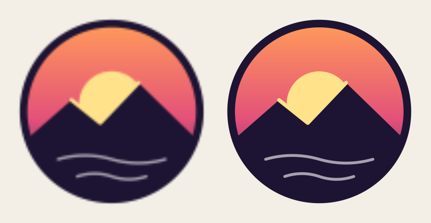

# ebitsvg

Draw SVG images in [Ebitengine] games, sharp at whatever size they are
displayed.

Ebitengine has no public SVG support. One workaround is to rasterize each SVG
once at load time, which blurs it when it is drawn larger and wastes texture
memory when it is drawn smaller; the other is to rebuild the artwork by hand
with `ebiten/vector`. ebitsvg draws the SVG file itself, rasterizing it again
when the size it is displayed at calls for it.



The same SVG displayed at 192 px. Left: rasterized once at 48 px and scaled
up 4× with bilinear filtering. Right: drawn by ebitsvg.

[API reference](https://pkg.go.dev/github.com/sagelyone/ebitsvg)

## Install

```sh
go get github.com/sagelyone/ebitsvg
```

ebitsvg needs Go 1.25 or later. On Linux, Ebitengine needs some system
packages; see its [install guide](https://ebitengine.org/en/documents/install.html).

## Quick start

Parse each SVG once, create an `Image` for each place it is drawn, and draw
it into a box from your game's `Draw` method:

```go
package main

import (
	"bytes"
	_ "embed"
	"log"
	"math"

	"github.com/hajimehoshi/ebiten/v2"
	"github.com/sagelyone/ebitsvg"
)

//go:embed logo.svg
var logoSVG []byte

type game struct {
	logo *ebitsvg.Image
}

func (g *game) Update() error { return nil }

func (g *game) Draw(screen *ebiten.Image) {
	b := screen.Bounds()
	g.logo.Draw(screen, 0, 0, float64(b.Dx()), float64(b.Dy()), nil)
}

// LayoutF returns whole device pixels, so that the logo is sharp on
// high-DPI displays, including at fractional scale factors.
func (g *game) LayoutF(w, h float64) (float64, float64) {
	s := ebiten.Monitor().DeviceScaleFactor()
	return math.Round(w * s), math.Round(h * s)
}

// Layout is never called, because game implements ebiten.LayoutFer.
func (g *game) Layout(int, int) (int, int) { panic("unreachable") }

func main() {
	svg, err := ebitsvg.Parse(bytes.NewReader(logoSVG))
	if err != nil {
		log.Fatal(err)
	}
	ebiten.SetWindowResizingMode(ebiten.WindowResizingModeEnabled)
	if err := ebiten.RunGame(&game{logo: ebitsvg.NewImage(svg)}); err != nil {
		log.Fatal(err)
	}
}
```

To watch an SVG follow the window size, run the example:

```sh
go run github.com/sagelyone/ebitsvg/examples/resize@latest
```

## Drawing

`Draw(dst, x, y, w, h, opts)` fits the SVG into the w×h box at (x, y). A nil
`opts` fits it inside the box, centered. `DrawOptions` has:

- `Fit`: `Contain` (the zero value) fits the SVG inside the box, `Cover`
  fills the box and clips the overflow, `Stretch` fills it exactly, ignoring
  the aspect ratio.
- `AlignX`, `AlignY`: where a `Contain` or `Cover` fit sits in the box, from
  -1 (left or top) through 0 (centered) to 1 (right or bottom).
- `GeoM`: transforms the placed box, for rotation, zoom or a camera. Its
  scale counts towards the displayed size, so zooming in rasterizes at the
  zoomed size.
- `ColorScale`, `Blend`: passed to `DrawImage`.

`Prepare` takes `Draw`'s arguments except `dst`, starts making what `Draw`
settles on, and reports whether it is ready, so that drawing with them shows
it at once. Like `Draw`, it never waits, so call it each frame until it
reports true, such as while a loading screen is shown:

```go
ready := true
for _, img := range images {
	// Prepare comes first, so that every Image starts rasterizing.
	ready = img.Prepare(x, y, 64, 64, nil) && ready
}
```

`SVG.Rasterize(w, h)` renders to an `*image.RGBA` on the CPU, for a window
icon or any other one-off image. It stretches the SVG to w×h; `SVG.Size`
gives the aspect ratio. `Size` is the viewBox size where there is one, not
the display size that width and height set: Material Symbols, for example,
report 960×960.

Sharpness is measured in pixels of `dst`, so `dst` must reach the screen
unscaled. On high-DPI displays, have `LayoutF` return device pixels, as above.
An SVG is sharp up to 4096 pixels on a side. Displayed larger, it is
magnified from a 4096-pixel raster and slightly soft, and a `Cover` fit's
clip edge can be off by up to half a raster pixel, about 1 px at 8192 px.

## Sprite sheets

A sprite sheet is one SVG with each sprite in a group with an id. A
rectangle in the group without fill or stroke sets the sprite's bounds: its
size, and the padding around its art.

```svg
<svg xmlns="http://www.w3.org/2000/svg" viewBox="0 0 128 64">
  <g id="walk-0">
    <rect width="64" height="64" fill="none"/>
    <!-- art -->
  </g>
  <g id="walk-1">
    <rect x="64" width="64" height="64" fill="none"/>
    <!-- art -->
  </g>
</svg>
```

`SVG.Sprite(id)` returns a sprite as an `SVG` of its own, sized to its
bounds and drawn without the rest of the sheet, so that an `Image` draws it
like any other SVG:

```go
sheet, err := ebitsvg.Parse(bytes.NewReader(sheetSVG))
if err != nil {
	log.Fatal(err)
}
walk := make([]*ebitsvg.Image, 2)
for i := range walk {
	s, err := sheet.Sprite(fmt.Sprintf("walk-%d", i))
	if err != nil {
		log.Fatal(err)
	}
	walk[i] = ebitsvg.NewImage(s)
}
```

Then draw the current frame from your game's `Draw` method, such as with
`walk[g.frame].Draw(screen, x, y, 64, 64, nil)`.

The bounds rectangle draws nothing, so the sheet still draws as a whole,
with each sprite in place. The first shape in the group, in document order,
that has an area and neither fill nor stroke sets the bounds, whether those
are set by attributes, `style` or a style sheet. A `<use>` element with an id is a
sprite too, which lets frames share art. The group's transform, opacity and
effects apply, as do its ancestors' transforms, such as an Inkscape layer's,
but not their opacity, clipping, masks or filters.

In Inkscape, set a group's id in Object Properties. Illustrator and Figma
export layer names as ids when their export settings ask them to.

To watch a sprite sheet animation, a ball bouncing, run the example:

```sh
go run github.com/sagelyone/ebitsvg/examples/bounce@latest
```

## How it works

An `Image` first draws a raster made for exactly the pixels it covers, 1:1.
While its size or subpixel position keeps changing, it draws from a raster
made at twice the displayed size, and reuses that raster until the displayed
size halves or doubles. Resizing a window therefore rasterizes only now and
then, and the raster is not magnified when drawn.

Once the same size and position have lasted two game ticks, the `Image`
draws an exact raster again. It keeps the 2× raster until they have lasted 60
ticks, and if they change within that time, it waits those 60 ticks before
making another exact raster. Content that moves in steps therefore reuses its
rasters, and a still `Image` ends up holding one. Moving by whole pixels keeps
the exact raster. A rotated or flipped `GeoM` stays on the 2× raster.

`Draw` never rasterizes, so it never makes a frame wait. An `Image` makes
the raster it needs on another goroutine, one at a time, and meanwhile draws
the closest raster it has, scaled, so that a resized SVG is briefly soft
rather than late. Rasterizing uses at most one fewer CPU than `GOMAXPROCS`,
leaving one for the game. `Draw` uploads a raster to the GPU in parts of
about 0.25 ms each, over 16 frames for the largest. A new `Image` draws
nothing until its first raster is ready, a few frames later; to show it at
once, `Prepare` it until it is ready.

In browsers, Go runs every goroutine on one thread, so rasterizing still
delays frames, by as long as it takes: about 250 ms for a 3000-pixel raster
of the resize example's emblem in Chrome. There, `Prepare` what you can
while loading, and keep SVGs drawn during play small or simple.

An `Image` caches for one target, so use one `Image` for each independently
drawn use of an SVG. A parsed `SVG` is immutable and safe to share, even
across goroutines; an `Image` is not safe for concurrent use.

## SVG support

Rendering uses [resvg], compiled to WebAssembly and translated to Go by
[wasm2go], so ebitsvg needs no Rust, and the renderer no cgo. `Parse` reads
UTF-8 or ASCII documents and renders static SVG 1.1 and the parts of SVG 2
that resvg supports: shapes and paths, fills and strokes, gradients and
patterns, clipping, masks, filters, markers, group opacity and blend modes,
nested `<svg>` elements, `<symbol>`, `<switch>`, `<use>` of any element,
`paint-order`, `vector-effect`, style sheets with CSS selectors, and lengths
in any unit.

Not supported:

- text and `<image>` elements, which are skipped;
- CSS Color 4 syntax, such as `rgb(0 0 0 / 50%)` or `hsl(240deg, 50%, 50%)`,
  which is ignored like any invalid value;
- `gradientTransform` inherited through a gradient's `href`: a gradient
  without its own `gradientTransform` is untransformed, because of a resvg
  bug.

As SVG specifies, invalid attribute and style values are ignored, as if they
were absent, and a `<use>` element that references itself or an ancestor
draws nothing.

`Parse` rejects documents whose root element is not `<svg>`, that are
compressed (.svgz) or encoded other than as UTF-8 or ASCII, whose size cannot
be determined (see `SVG.Size`), or that are not well-formed XML, which
includes using entities other than XML's own and those the DOCTYPE declares,
such as `&nbsp;`, and namespace prefixes such as `xlink:` that are not
declared. It also rejects documents with too many elements, including those
`<use>` elements copy, which a cycle of them makes unbounded, and documents
that nest elements more than 256 deep. It reads all of its input: to parse
untrusted input, limit its size with `io.LimitReader`.

If rasterizing needs more memory than the renderer may use, 256 MiB, which a
filter over a large raster can, the raster is transparent.

To recolor an icon drawn in `currentColor`, replace that keyword with a color
before parsing:

```go
src = regexp.MustCompile(`(?i)currentcolor`).ReplaceAll(src, []byte("tomato"))
```

## Startup

The renderer is Go code, compiled with your program, so it starts at once:
the first `Parse` of an icon takes about 1 ms on a desktop computer. It is
6.6 MB of generated source, which the first build compiles in about 6 s on a
16-core desktop computer, using up to 2 GB of memory; later builds reuse it
from Go's build cache.

## Testing

Tests need a display. On headless Linux, run them with `xvfb-run -a go test
./...`. The reference images in `testdata` are rendered with `rsvg-convert`;
the comment on `TestReference` in `svg_test.go` gives the command.

`BenchmarkParse` and `BenchmarkRasterize` measure the SVGs in `testdata`.
`internal/cmd/probe` measures how long the first `Parse` takes and how much
memory ebitsvg uses on Linux:

```sh
go run ./internal/cmd/probe [-size n] file.svg
```

`internal/resvg/internal/shim` is generated and committed, so that building
ebitsvg needs no Rust. To regenerate it and
`internal/resvg/THIRD_PARTY_NOTICES` after changing `internal/resvg/shim`,
install [rustup], binaryen's `wasm-opt` and `cargo-about`, and run `go
generate ./internal/resvg` with Go 1.26 or later, which wasm2go needs. The
build is reproducible, and CI checks that the committed files match their
sources. `go vet` and staticcheck report dead code in the generated package,
so check the others:

```sh
go vet $(go list ./... | grep -v /internal/shim$)
```

## License

MIT. `internal/resvg/internal/shim` is translated from resvg and other Rust
crates under the MIT and BSD licenses, whose notices
[internal/resvg/THIRD_PARTY_NOTICES](internal/resvg/THIRD_PARTY_NOTICES)
reproduces, so programs distributed in binary form must reproduce those
notices too.

[Ebitengine]: https://ebitengine.org
[resvg]: https://github.com/linebender/resvg
[rustup]: https://rustup.rs
[wasm2go]: https://github.com/ncruces/wasm2go
